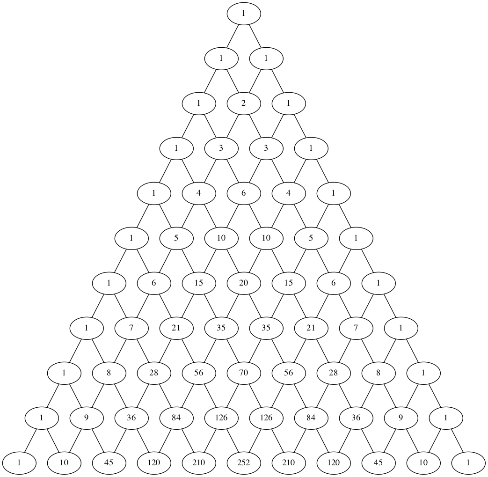

# Pascal's Triangle with Graphical Representation

## Dependencies

To install the required dependencies, run the following command:

```shell
$ pip install -r requirements.txt
```

## Usage

To run the program, use the following command:

```shell
$ ./main.py [-g|--graph] [-d|--debug] [-r|--read]
```

By default, the program generates a graphical representation of Pascal's triangle and saves it as a PNG image in the `./out/Graph.gv.png` directory.

### Options

- `-g, --graph`: Generates a pictorial representation of Pascal's triangle. The output is saved as a PNG image.
- `-d, --debug`: Displays the schema of the graph and the elapsed time.
- `-r, --read`: Reads Pascal's triangle data from a local `.gv` file.

## Example

Below is an example of a pictorial representation of Pascal's triangle with PNG support.

<!-- Links and references -->

